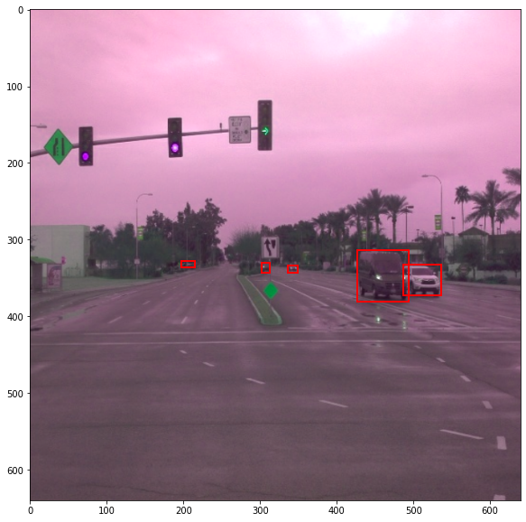
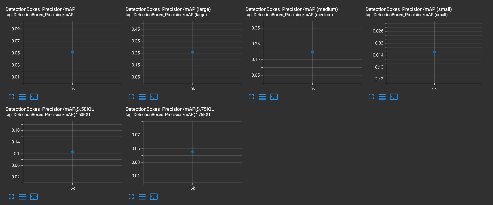

# Object Detection in an Urban Environment

## Project overview
This project trains a convolutional neural network to detect and classify objects using data from Waymo.
We are using a dataset of images of urban environments containing annotated cyclists, pedestrians and vehicles.

## Data
For this project, we will be using data from the [Waymo Open dataset](https://waymo.com/open/).  
[OPTIONAL] - The files can be downloaded directly from the website as tar files or from the [Google Cloud Bucket](https://console.cloud.google.com/storage/browser/waymo_open_dataset_v_1_2_0_individual_files/) as individual tf records. We have already provided the data required to finish this project in the workspace, so you don't need to download it separately.

## Structure

### Data

The data you will use for training, validation and testing is organized as follows:
```
/home/workspace/data/waymo
    - training_and_validation - contains 97 files to train and validate your models
    - train: contain the train data (empty to start)
    - val: contain the val data (empty to start)
    - test - contains 3 files to test your model and create inference videos
```

The `training_and_validation` folder contains file that have been downsampled: we have selected one every 10 frames from 10 fps videos. The `testing` folder contains frames from the 10 fps video without downsampling.

You will split this `training_and_validation` data into `train`, and `val` sets by completing and executing the `create_splits.py` file.

### Experiments
The experiments folder will be organized as follows:
```
experiments/
    - pretrained_model/
    - exporter_main_v2.py - to create an inference model
    - model_main_tf2.py - to launch training
    - reference/ - reference training with the unchanged config file
    - experiment0/ - create a new folder for each experiment you run
    - experiment1/ - create a new folder for each experiment you run
    - experiment2/ - create a new folder for each experiment you run
    - label_map.pbtxt
    ...
```

## Prerequisites and Set up

### Local Setup

For local setup if you have your own Nvidia GPU, you can use the provided Dockerfile and requirements in the [build directory](./build).

Follow [the README therein](./build/README.md) to create a docker container and install all prerequisites.

### Download and process the data
The first goal of this project is to download the data from the Waymo's Google Cloud bucket to your local machine. For this project, we only need a subset of the data provided (for example, we do not need to use the Lidar data). Therefore, we are going to download and trim immediately each file. In `download_process.py`, you can view the `create_tf_example` function, which will perform this processing. This function takes the components of a Waymo Tf record and saves them in the Tf Object Detection api format. An example of such function is described [here](https://tensorflow-object-detection-api-tutorial.readthedocs.io/en/latest/training.html#create-tensorflow-records). We are already providing the `label_map.pbtxt` file.

You can run the script using the following command:
```
python download_process.py --data_dir {processed_file_location} --size {number of files you want to download}
```

You are downloading 100 files (unless you changed the `size` parameter) so be patient! Once the script is done, you can look inside your `data_dir` folder to see if the files have been downloaded and processed correctly.

## Analysis and writeup
#### Dataset analysis
Data analysis was performed in the "Exploratory Data Analysis.ipynb" notebook.  
The dataset contains images with annotations for three relevant classes: cyclists, pedestrians and vehicles/cars.
Here are some example images from the dataset:  


It's important to note that the count of the three classes is very different, see this plot:  


Also, each image can contain many vehicles at one, regularly up to 40. See this plot:  


#### Cross validation
The model was trained with the training data only but using the validation data different models can be compared.  
The final model can be run on new test data and the code also include the option to output a video animation of the performance.

### Training
#### Reference experiment
The reference configuration results in very poor performance. For the test data, no objects are detected for the tested scene.
The results of reference model are shown below:  

The validation loss values are:
- 0.6991 classification loss
- 0.9528 localization loss

The loss is very much not smooth and does not converge to a good value in the 2500 steps. Because the loss fluctuates soo much, the difference between eval and train might just be fluctuations.
Precision and recall are very poor:  
  


#### Improve on the reference
To improve the performance, two main changes are made: adding better data augmentation and training differently for better convergence.  
The second experiment I tried (experiment2) resulted in acceptable performance for this project.
I choose augmentations that make sense for the scenario. Other options like e.g. vertical flips would not make sense, because cars are usually not upside down on the road.  
I focused on changes that change the lighting and color of the image to "simulate" different times of day, weather or illumination.  
These are the augmentations I choose:
- random_horizontal_flip
- random_crop_image (kept from reference)
- random_adjust_hue
- random_adjust_brightness
- random_adjust_contrast

Here are some example images with applied augmentation:  





To improve the performance further and get a better convergence for the loss, I also made these changes to the training:  
- increase batch size from 2 to 4 because this can improve training (larger values did not work because of GPU memory)
- train for 6000 instead of 2500 steps
- use 800 instead of 200 warmup steps

These changes helped to further improve the loss values. The important classification and localization losses are significantly reduced for the eval data:  
- 0.3506 classification loss
- 0.5662 localization loss

The loss still fluctuates but it converges better. No over-fitting occurs (difference between train and eval from fluctuations).  
The loss is shown below:  


Precision and recall also increase dramatically, e.g.    
- 0.05195 DetectionBoxes_Precision/mAP (>300x better)
- 0.01451 DetectionBoxes_Recall/AR@1 (basically 0 before)


Plots:  



The model is also able to detect some cars in new data while the reference did not. However, it does not detect all cars (actually only few) and also detects some cars as multiple or hallucinates detections.  
Here are some frames showing example performance:  


